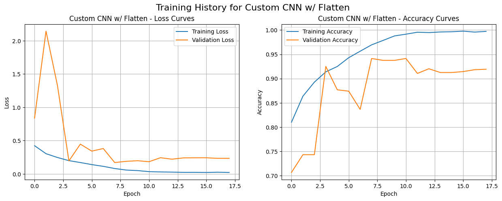
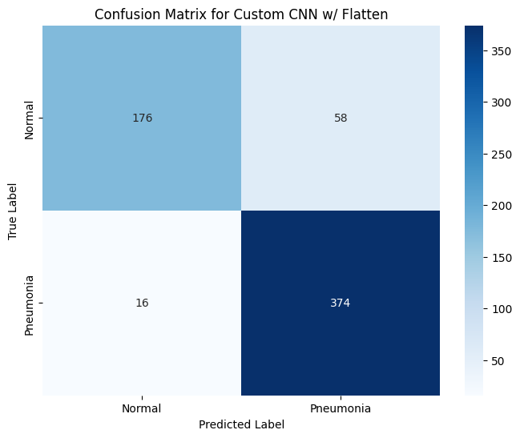
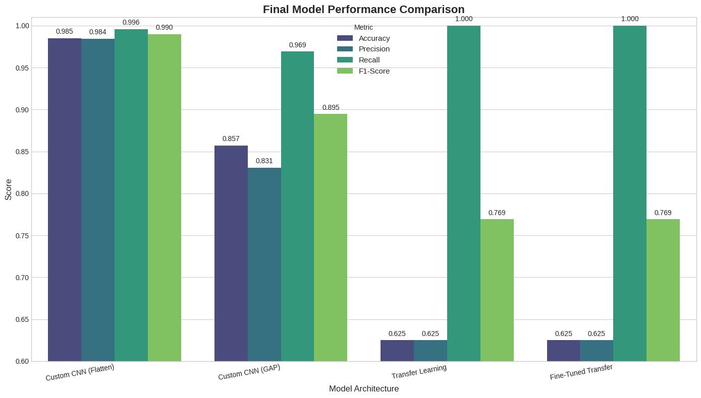

# AI-Powered Pneumonia Detection from Chest X-rays

An end-to-end deep learning pipeline built with Python and TensorFlow/Keras to classify chest X-ray images as either "Normal" or "Pneumonia." This project involved benchmarking multiple architectures, where a custom-built CNN ultimately outperformed a standard transfer learning approach.

## Project Results & Visualizations

The success of this project is demonstrated by the performance of the final custom-built model. The visualizations below showcase the evidence from the final training run on the test set.

#### Performance Metrics
*The primary goal was to create a highly reliable classifier with a balance of precision and recall. The final **Custom CNN model ** achieved an exceptional **99.0% F1-Score** and **99.6% Recall** on the test set.*

#### Training History of the Winning Model

*(Caption: The Custom CNN's accuracy and loss curves, showing successful learning and convergence on the validation set.)*

#### Confusion Matrix of the Winning Model

*(Caption: The Custom CNN's confusion matrix on the test set, highlighting its extremely low number of false negatives and false positives.)*

#### Final Model Comparison

*(Caption: A comparison of all four tested models, visually demonstrating the superior balanced performance of the custom CNN architecture.)*

## Key Features

-   **High-Performance Custom CNN:** Architected a custom Convolutional Neural Network that achieved a **99.0% F1-Score**, outperforming a standard fine-tuned `EfficientNetB0` transfer learning approach.
-   **End-to-End ML Pipeline:** A complete and reproducible workflow from data pre-processing (`tf.data`) to model training and evaluation of four different architectures.
-   **Robust Training Techniques:** Implemented methods to combat severe dataset class imbalance (class weights) and overfitting (dropout, batch normalization).
- **Reproducible Workflow:** The entire experiment is contained within a single Jupyter Notebook.

## Tech Stack

-   **Primary Language:** Python
-   **Core Libraries:** TensorFlow, Keras, Scikit-learn, NumPy, Pandas
-   **Data Visualization:** Matplotlib, Seaborn

## Getting Started

There are two recommended ways to run this project:

### Option A: Run in Google Colab (Recommended)

The easiest way to run this project is using the provided Google Colab notebook, which includes a free GPU runtime. The notebook will automatically download the required public dataset from Kaggle with no API keys or setup required.

[](https://colab.research.google.com/github/Jimi-Wilson/XRay-Pneumonia-Classifier/blob/main/pneumonia-detection.ipynb)

Click the badge above, then in the Colab notebook, click **Runtime > Run all**.

### Option B: Run on a Local Machine

#### Prerequisites
- Python 3.10+, `pip`, `venv`
- A CUDA-enabled GPU with appropriate drivers is highly recommended.

#### Setup and Installation
1. **Clone the repository:**
    ```bash
    git clone https://github.com/Jimi-Wlson/XRay-Pneumonia-Classifier.git
    cd XRay-Pneumonia-Classifier
    ```
2. **Set up Kaggle API:**
    - Ensure your `kaggle.json` file is located at `~/.kaggle/kaggle.json`.
3. **Create and activate a virtual environment:**
    ```bash
    python -m venv venv
    source venv/bin/activate
    ```
4. **Install dependencies:**
    ```bash
    pip install -r requirements.txt
    ```
5. **Run the Notebook:**
    - Launch Jupyter Notebook: `jupyter notebook`
    - Open the `pneumonia-detection.ipynb` file.

### Usage
To run the full training and evaluation pipeline, execute the main Jupyter Notebook: `pneumonia-detection.ipynb`. The notebook contains the step-by-step process for all four models.

## License

This project is licensed under the MIT License.